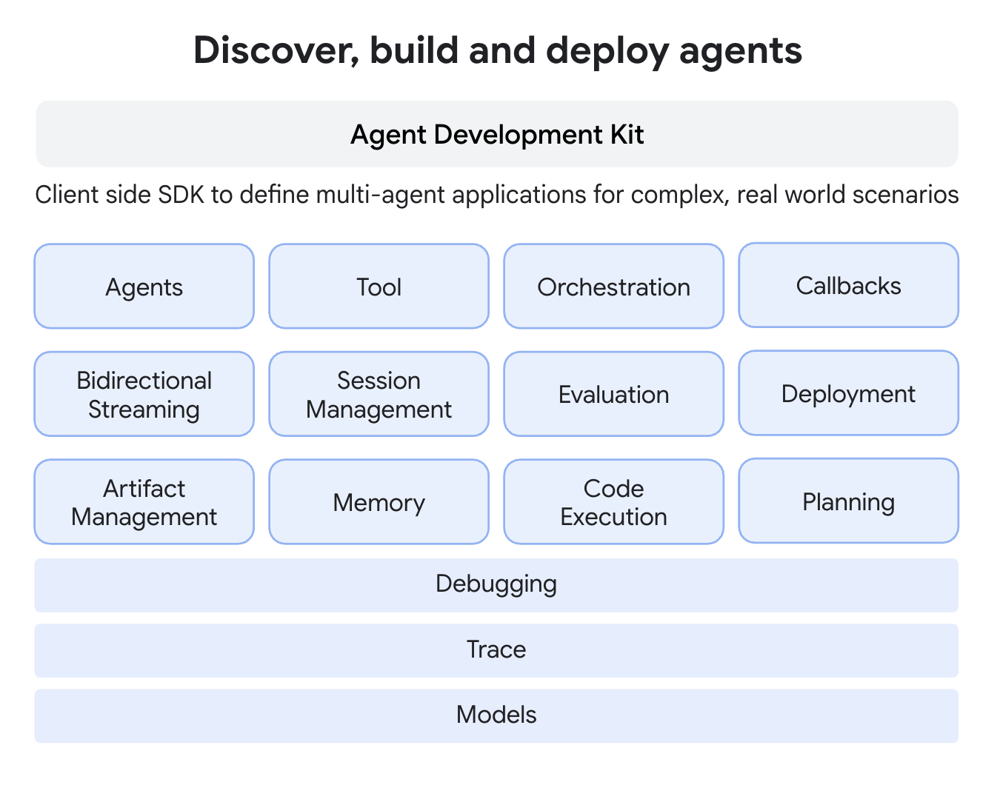

# Agent Development Kit (ADK)

 <b> Build, Evaluate and Deploy agents, seamlessly! </b> 

The Agent Development Kit (ADK) is designed to empower developers
to build, manage, evaluate and deploy AI-powered agents. It provides a robust
and flexible environment for creating both conversational and non-conversational
agents, capable of handling complex tasks and workflows.

## Core Concepts

ADK is built around a few key primitives and concepts that make it
powerful and flexible. Here are the essentials:

* **Agent:** The fundamental worker unit designed for specific tasks. Agents can
  use language models (`LlmAgent`) for complex reasoning or act as controllers
  (`SequentialAgent`, `ParallelAgent`) to manage workflows.
* **Tool:** Gives agents abilities beyond conversation, letting them interact
  with external APIs, search information, run code, or call other services.
* **Callbacks:** Custom code snippets you provide to run at specific points in
  the agent's process, allowing for checks, logging, or behavior modifications.
* **Session Management (`Session` & `State`):** Handles the context of a single
  conversation (`Session`), including its history (`Events`) and the agent's
  working memory for that conversation (`State`).
* **Memory:** Enables agents to recall information about a user across
  *multiple* sessions, providing long-term context (distinct from short-term
  session `State`).
* **Artifact Management (`Artifact`):** Allows agents to save, load, and manage
  files or binary data (like images, PDFs) associated with a session or user.
* **Code Execution:** The ability for agents (usually via Tools) to generate and
  execute code to perform complex calculations or actions.
* **Planning:** An advanced capability where agents can break down complex goals
  into smaller steps and plan how to achieve them like a ReAct planner.
* **Models:** The underlying LLM that powers `LlmAgent`s, enabling their
  reasoning and language understanding abilities.
* **Event:** The basic unit of communication representing things that happen
  during a session (user message, agent reply, tool use), forming the
  conversation history.
* **Runner:** The engine that manages the execution flow, orchestrates agent
  interactions based on Events, and coordinates with backend services.

***Note:** Features like Multimodal Streaming, Evaluation, Deployment,
Debugging, and Trace are also part of the broader ADK ecosystem, supporting
real-time interaction and the development lifecycle.*

## Key Capabilities

Agent Development Kit offers several key advantages for developers building
agentic applications:

1. **Multi-Agent System Design:** Easily build applications composed of
   multiple, specialized agents arranged hierarchically. Agents can coordinate
   complex tasks, delegate sub-tasks using LLM-driven transfer or explicit
   `AgentTool` invocation, enabling modular and scalable solutions.
2. **Rich Tool Ecosystem:** Equip agents with diverse capabilities. ADK
   supports integrating custom functions (`FunctionTool`), using other agents as
   tools (`AgentTool`), leveraging built-in functionalities like code execution,
   and interacting with external data sources and APIs (e.g., Search,
   Databases). Support for long-running tools allows handling asynchronous
   operations effectively.
3. **Flexible Orchestration:** Define complex agent workflows using built-in
   container agents (`SequentialAgent`, `ParallelAgent`, `LoopAgent`) alongside
   LLM-driven dynamic routing. This allows for both predictable pipelines and
   adaptive agent behavior.
4. **Integrated Developer Tooling:** Develop and iterate locally with ease.
   ADK includes tools like a command-line interface (CLI) and a Developer
   UI for running agents, inspecting execution steps (events, state changes),
   debugging interactions, and visualizing agent definitions.
5. **Native Streaming Support:** Build real-time, interactive experiences with
   native support for bidirectional streaming (text and audio). This integrates
   seamlessly with underlying capabilities like the
   [Multimodal Live API for the Gemini Developer API](https://ai.google.dev/gemini-api/docs/live)
   (or for
   [Vertex AI](https://cloud.google.com/vertex-ai/generative-ai/docs/model-reference/multimodal-live)),
   often enabled with simple configuration changes.
6. **Built-in Agent Evaluation:** Assess agent performance systematically. The
   framework includes tools to create multi-turn evaluation datasets and run
   evaluations locally (via CLI or the developer UI) to measure quality and
   guide improvements.
7. **Broad LLM Support:** While optimized for Google's Gemini models, the
   framework is designed for flexibility, allowing integration with various LLMs
   (potentially including open-source or fine-tuned models) through its
   `BaseLlm` interface.
8. **Artifact Management:** Enable agents to handle files and binary data. The
   framework provides mechanisms (`ArtifactService`, context methods) for agents
   to save, load, and manage versioned artifacts like images, documents, or
   generated reports during their execution.
9. **Extensibility and Interoperability:** ADK promotes an open
   ecosystem. While providing core tools, it allows developers to easily
   integrate and reuse tools from other popular agent frameworks including
   LangChain and CrewAI.
10. **State and Memory Management:** Automatically handles short-term
    conversational memory (`State` within a `Session`) managed by the
    `SessionService`. Provides integration points for longer-term `Memory`
    services, allowing agents to recall user information across multiple
    sessions.

## Get Started

* Ready to build your first agent? [Try the quickstart](./quickstart.md)
